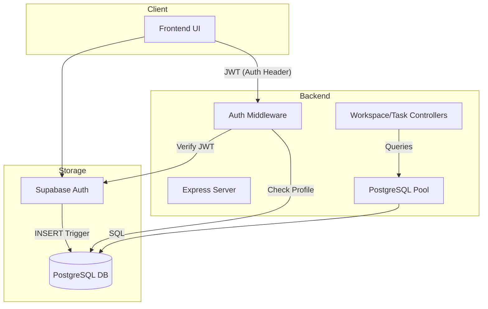

# Architecture Overview (MVP v0.5)

## System Flow
The following diagram represents the core data flow between the client, backend, and Supabase.

## Key Design Decisions

### 1. **Transition from MongoDB to PostgreSQL**
ClarityOS relies heavily on relational integrity. Tasks, subtasks, dependencies, and threaded comments form a complex web that is natively handled better by a relational database (PostgreSQL) than by a document store (MongoDB). This change allows:
- **Recursive Task Hierarchies**: Using `parent_task_id` for nested tasks.
- **Blocking Dependencies**: Enforcing task completion order via the `task_dependencies` table.
- **Threaded Comments**: Self-referencing table with `parent_comment_id` for nested replies.

### 2. **One Workspace per User Globally**
A user is restricted to belonging to exactly one workspace at any given time (whether as an owner or a member). This simplifies the UI and ensures we don't have to carry workspace IDs across every request. The backend can derive the user's current workspace directly from their database profile during the authentication phase.
- **DB Enforcement**: `UNIQUE(user_id)` on the `workspace_members` table.

### 3. **Automatic User Creation via Trigger**
Instead of manually creating a user profile in our own DB after a frontend signup, we use a Supabase database trigger.
- **How**: When a row is inserted in `auth.users`, a trigger fires that copies the ID, email, and metadata into `public.users`.
- **Why**: Ensures consistency and avoids race conditions where a user might be signed up but their profile is missing when they first hit our API.

## Security Model

### 1. Auth & Identification
All protected routes use the `auth.middleware.ts` to:
- Extract the JWT from the `Authorization: Bearer <token>` header.
- Verify the token with the Supabase Admin client.
- Look up the user's `public.users` profile and attach it to `req.user`.

### 2. Relational Security (RLS Foundations)
We currently rely on the backend to enforce scoping (e.g., only fetching tasks for a user's own workspace). In the future, this can be extended to native Supabase Row Level Security (RLS) for additional defense-in-depth.

### 3. Cascade Deletions
Hard deletions for tasks and comments are managed at the database level with `ON DELETE CASCADE`. This prevents orphaned records and ensures data integrity during deletions (e.g., deleting a parent comment automatically removes its replies).
