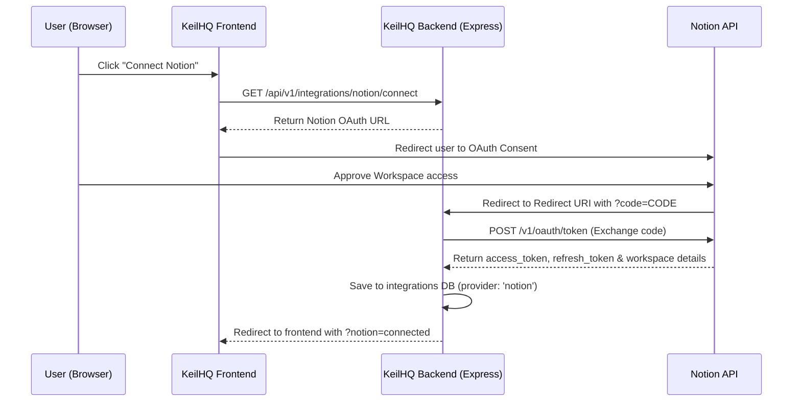

# Notion Public Connection & 2-Way Sync Integration

This document describes the design, architecture, and developer workflow for the **Notion Public Connection Integration** inside KeilHQ.

---

## 1. Architecture Overview

KeilHQ uses **OAuth 2.0 (Public Connections)** to interface with users' Notion workspaces. This allows any external workspace user to authorize KeilHQ and export/sync pages directly into their private or shared workspace.



---

## 2. Core Service & Controller Architecture

The Notion integration is divided into:
- **Routes**: Registered in [integration.routes.ts](file:///Users/shivangkandoi/Desktop/Keil-App/backend/src/routes/integration.routes.ts)
- **Controllers**: Handled in [notion.controller.ts](file:///Users/shivangkandoi/Desktop/Keil-App/backend/src/controllers/notion.controller.ts)
- **Service Layer**: Programmatic Notion API wrapper and parser inside [notion.service.ts](file:///Users/shivangkandoi/Desktop/Keil-App/backend/src/services/notion.service.ts)

### API Endpoints Reference

| Method | Endpoint | Protection | Description |
| :--- | :--- | :--- | :--- |
| `GET` | `/api/v1/integrations/notion/connect` | Authenticated | Generates Notion OAuth URL |
| `GET` | `/api/v1/integrations/notion/callback` | Public | Exchanges OAuth authorization code |
| `POST` | `/api/v1/integrations/notion/manual-connect` | Authenticated | Connects via manual/internal integration token |
| `GET` | `/api/v1/integrations/notion/status` | Authenticated | Check if Notion is connected and returns workspace info |
| `DELETE` | `/api/v1/integrations/notion` | Authenticated | Disconnects Notion and unlinks user's pages |
| `POST` | `/api/v1/integrations/notion/import` | Authenticated | Imports a Notion page to KeilHQ |
| `POST` | `/api/v1/integrations/notion/export` | Authenticated | Exports a KeilHQ page to Notion |
| `POST` | `/api/v1/integrations/notion/sync` | Authenticated | Manually triggers 2-way sync on a linked page |
| `POST` | `/api/v1/integrations/notion/unlink` | Authenticated | Clears Notion linkage on a specific page |

---

## 3. Implementation Details

### Token Verification Flow
Before any API operations are executed (import, export, sync), the backend validates the integration connection:
1. Calls Notion `GET https://api.notion.com/v1/users/me`
2. If `401 Unauthorized` is returned, the automatic fetch wrapper (`fetchNotion`) attempts to refresh the access token using the stored `refresh_token`.
3. If token refresh fails or is not available, it maps to a user-facing action to reconnect.

### Workspace-level Page Creation
* For **Public Connections**, pages are created directly at the workspace root without asking for a parent ID:
  ```json
  {
    "parent": { "type": "workspace", "workspace": true },
    "properties": {
      "title": { "title": [{ "text": { "content": "Page Title" } }] }
    },
    "markdown": "# Page Title\nContent..."
  }
  ```
* If workspace root creation fails (e.g. for personal internal tokens that don't support workspace root), the service catches the error and falls back to **Auto-Discovery** via `findFirstAvailableParentPage` to locate pages/databases shared with the integration.

### Content Conversion (Strictly Non-AI)
> [!IMPORTANT]
> To comply with absolute user privacy, **no AI, LLMs, or summarization tools are used during Notion export/sync.** 
> Conversion is done entirely client-side/server-side using high-fidelity local parser scripts:
> - `tiptapToMarkdown`: Translates structured TipTap blocks (headings, paragraphs, bullet lists, blockquotes, codeblocks, checklists) to Markdown.
> - `markdownToTiptap`: Parses incoming Notion page Markdown back into structured TipTap blocks.

### Page Overwriting & Command Execution
When performing a **Link & Append** or syncing, the backend sends a PATCH request using the specialized `/markdown` endpoint command to replace content cleanly:
```json
{
  "command": "replace_content",
  "markdown": "# Updated Title\nContent text..."
}
```

### Bidirectional Sync Mechanics
Syncing runs on a **Last-Write-Wins** protocol:
1. Fetches both local page metadata and Notion page metadata.
2. Compares `notionMeta.last_edited_time` against local `page.updated_at` with respect to the `notion_last_synced_at` timestamp.
3. If conflict arises, compares last-write timestamps.
4. Executes sync in the winning direction:
   * **Local -> Notion**: Rewrites Notion markdown content and matches properties (Title, Icon, Cover).
   * **Notion -> Local**: Parses Notion markdown into TipTap blocks and updates the local postgres db.

---

## 4. Error Handling & Capability Mapping

The backend intercepts all HTTP request failures and throws descriptive messages:

* **Page Access (404)**: Instructs the user to explicitly share the Notion page with the integration.
* **Capabilities (403)**: Informs the user they are missing read/insert/update capabilities and points them to update their integration scopes.
* **Token Expired (401)**: Prompts a reconnect command.

---

## 5. Frontend Integration Hooks

Found inside [useNotion.ts](file:///Users/shivangkandoi/Desktop/Keil-App/frontend/src/hooks/api/useNotion.ts), the application leverages React Query mutations and queries:
- `useNotionStatus()`: Queries connection status.
- `useConnectNotion()`: Redirects to OAuth callback server.
- `useDisconnectNotion()`: Resets all connections and page links.
- `useExportNotionPage()`: Post-trigger with `mode: 'create' | 'append'`.
- `useSyncNotionPage()`: Re-syncs a linked page.
- `useUnlinkNotionPage()`: Clears the page linkage on a single document.
