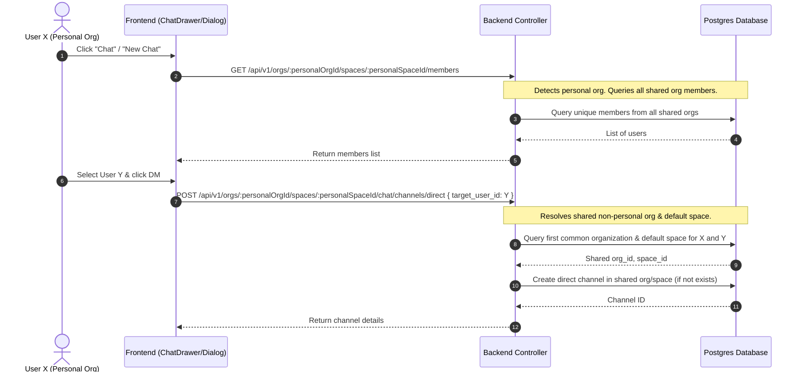

# Plan: Personal Organisation Chat Integration

This plan outlines the phase-wise implementation to make the chat module accessible within the Personal Organisation, allowing users to initiate Direct Messages (DMs) with any member of any organization they have joined.

## Context & Objectives
*   **Goal:** Enable users to view, search, and message members from all of their shared organizations while working within their personal workspace environment.
*   **Encapsulation & Security:** Ensure data isolation. Personal organizations have no other members; therefore, DMs must be created and stored within a shared, non-personal organization that both users have in common.
*   **No Group Chats:** Group chats/channels are disabled when in the Personal Workspace.

---

## Architecture Design

---

## Phase-Wise Implementation

### Phase 1: Backend Support for Personal Workspace Chat

#### Task 1.1: Support Cross-Org Channel Aggregation
Modify `getUserChannels` in [org-chat.service.ts](file:///s:/1-Project/Quild/Keil-App/backend/src/services/org-chat.service.ts) to detect if the requested `orgId` is personal. If true, query all channels the user belongs to across **all** of their organizations.

#### Task 1.2: Support Unified Member Directory Retrieval
Modify `getSpaceMembers` in [space.service.ts](file:///s:/1-Project/Quild/Keil-App/backend/src/services/space.service.ts) and the controller in [space.controller.ts](file:///s:/1-Project/Quild/Keil-App/backend/src/controllers/space.controller.ts) to:
1.  Accept the current `userId` as an optional parameter.
2.  If the requested `orgId` is personal, query all unique members from all **non-personal** organizations the current user belongs to (excluding themselves).

#### Task 1.3: Support Auto-Mapping on DM Creation
Modify `createDirectChannel` in [org-chat.controller.ts](file:///s:/1-Project/Quild/Keil-App/backend/src/controllers/org-chat.controller.ts) to:
1.  Check if the requested `orgId` is a personal organization.
2.  If personal, run a SQL query to identify a shared non-personal organization (and its default/first space) that the current user and target user share.
3.  If no shared organization exists, return a `400 Bad Request` ("You do not share any organisations with this user").
4.  Use this resolved organization and space to find or create the direct channel.

---

### Phase 2: Frontend Visibility & Integration

#### Task 2.1: Enable Sidebar Chat Option
Modify [AppSidebar.tsx](file:///s:/1-Project/Quild/Keil-App/frontend/src/components/AppSidebar.tsx) to make the Chat navigation item visible when `activeOrgId && activeSpaceId` are set, regardless of whether it is a personal or standard organization.

#### Task 2.2: Update Socket Manager Scoping
Modify [ChatSocketManager.tsx](file:///s:/1-Project/Quild/Keil-App/frontend/src/components/chat/ChatSocketManager.tsx) to mount listeners for both `personal` and `organisation` modes.

#### Task 2.3: Disable Group Chats in Personal Mode
Modify [NewChatDialog.tsx](file:///s:/1-Project/Quild/Keil-App/frontend/src/components/chat/NewChatDialog.tsx) to check if the current mode is `personal`. If it is:
1.  Hide/Disable the "Group / Channel" tab.
2.  Only show the "Direct Message" interface.

---

## Constraints & Edge Cases
1.  **No Shared Organization:** If User X is in personal mode and tries to DM User Y, but they don't share any non-personal organization, the creation request must fail gracefully with a clean user-facing message.
2.  **Multiple Shared Organizations:** If multiple shared organizations exist, we resolve to the oldest shared organization's default space to ensure channel creation is deterministic.
3.  **Real-Time Socket Events:** Since socket events are room-scoped by `channel_id`, they will automatically work perfectly across different organizations without any changes to the socket server.

---

## Acceptance Criteria

### Backend Validation
*   `GET /api/v1/orgs/:personalOrgId/spaces/:personalSpaceId/chat/channels` successfully returns all channels the user belongs to across all their organizations.
*   `GET /api/v1/orgs/:personalOrgId/spaces/:personalSpaceId/members` successfully returns all unique users across all organizations the current user belongs to (excluding themselves).
*   `POST /api/v1/orgs/:personalOrgId/spaces/:personalSpaceId/chat/channels/direct` successfully maps the channel creation to the first shared non-personal organization between the users.

### Frontend Validation
*   The Chat option is visible in the sidebar while in Personal Workspace.
*   Typing indicators, message receipts, and active channel updates work flawlessly in real-time in personal mode.
*   Group Chat tab is completely hidden when creating a new chat from the Personal Workspace.
