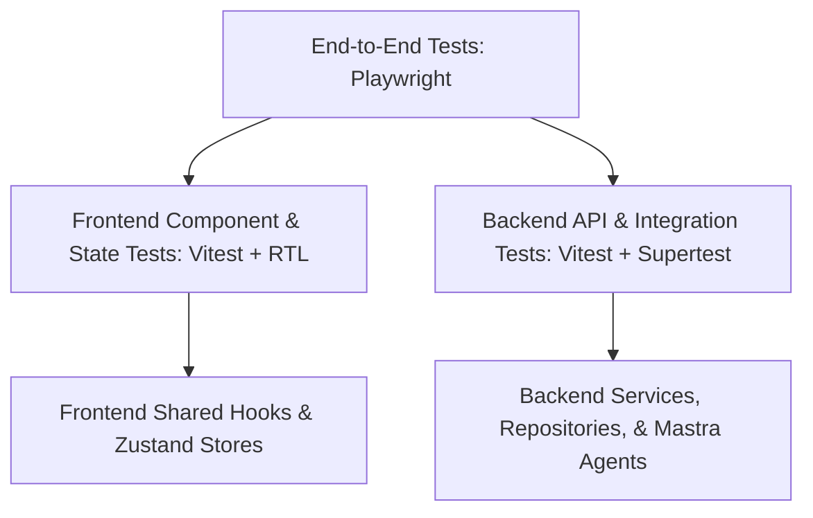

# Testing Implementation Plan for Keil-App

This document outlines the testing strategy, architecture, and step-by-step setup guides for both the `backend` and `frontend` of the Keil-App codebase. It provides a robust, fast, and easy-to-maintain structure for developers to write, execute, and verify tests.

---

## 1. Testing Architecture & Scope

To ensure both features work properly and regressions are prevented, we implement a **three-tiered testing strategy**:



### 1.1 Backend Testing (API & Integration)
*   **Tooling:** `Vitest` + `Supertest`
*   **Approach:** Instead of mocking every database call (which makes tests brittle and hides schema issues), we run integration tests that hit Express routes, execute middleware, write to a real test database, and return JSON responses.
*   **Database Isolation:** Connect to a dedicated test PostgreSQL instance, running schema migrations before tests and cleaning up (truncating tables) between test suites.
*   **Supabase Auth Bypass:** In integration tests, we mock the authentication middleware to inject pre-configured mock users. This removes dependencies on external Supabase API keys/network speeds during testing.

### 1.2 Frontend Testing (Components & Global Stores)
*   **Tooling:** `Vitest` + `React Testing Library (RTL)` + `happy-dom` (fast browser simulation)
*   **Approach:** Focus on testing user-visible behavior (e.g., clicking buttons, submitting forms, verifying validation errors) rather than internal React states.
*   **State & Cache Testing:** Unit test Zustand stores (`src/store/`) and TanStack Query behavior under controlled conditions.
*   **API Mocking:** Use MSW (Mock Service Worker) or standard Vitest fetch mocks to intercept frontend API calls, ensuring UI components behave properly under successful, loading, or failed API responses.

### 1.3 End-to-End (E2E) Browser Testing
*   **Tooling:** `Playwright`
*   **Approach:** Runs real browser instances (Chromium, WebKit, Firefox) to execute critical user journeys.
*   **Primary Targets:** Real-time socket-based messaging (collab chat), meeting recorders (simulating microphone/audio feeds), and page layouts (Gantt, Sidebar, calendar interactions).

---

## 2. Supabase & Database Testing Strategy

Since Keil-App uses Supabase (managed PostgreSQL + Supabase Client for file storage and administration), we must answer: **How do we test a Supabase-backed app without modifying production data or hitting rate limits?**

### 2.1 The Two Database Approaches (Your Choice)

We have two clean options for the database during backend tests:

| Strategy | Setup Overhead | Testing Fidelity | Best For |
| :--- | :--- | :--- | :--- |
| **Option A: Dedicated Test DB (Recommended)** | Low-Medium (Requires a separate Supabase project or a local PostgreSQL container). | **Very High** (Tests actual SQL, constraints, and migrations). | Verifying database repositories, Mastra storage state, and raw queries. |
| **Option B: Repository & Pool Mocking** | Low (All database queries are mocked at the pg-pool level). | **Medium** (Fast, but does not verify if SQL syntax or table constraints are correct). | Testing Express controller flow, authorization middlewares, and schema validation. |

### 2.2 How Auth Testing Works (Bypassing Supabase Auth)
Your backend verifies Supabase JWTs in middlewares (like checking authorization headers). Making actual requests to Supabase Auth during testing is slow and requires active internet access.
*   **Solution:** In `test/setup.ts`, we mock the validation middleware:
    ```typescript
    // Example Mock for Auth Middleware
    vi.mock("../middlewares/auth", () => ({
        verifyToken: (req, res, next) => {
            req.user = { id: "test-user-uuid", email: "test@keilhq.in", orgId: "test-org-uuid" };
            next();
        }
    }));
    ```
This enables testing different authorization roles (Admin, Manager, User) by simply altering the mocked user object in individual test files.

---

## 3. Testing Directory Structure

To keep the codebase clean, tests will be colocated or placed in dedicated test directories.

### 3.1 Backend File Structure
```
backend/
├── src/
│   ├── routes/
│   │   └── org.routes.ts
│   │   └── __tests__/
│   │       └── org.routes.test.ts   <-- API route integration tests
│   ├── services/
│   │   └── task-overdue-worker.service.ts
│   │   └── __tests__/
│   │       └── task-worker.test.ts   <-- Business logic tests
├── test/
│   ├── setup.ts                      <-- Global Vitest setup (DB connection, mocks)
│   ├── helpers.ts                    <-- Test seeding, JWT token generators, DB cleaners
└── vitest.config.ts                  <-- Backend Vitest configuration
```

### 3.2 Frontend File Structure
```
frontend/
├── src/
│   ├── store/
│   │   └── __tests__/
│   │       └── workspaceStore.test.ts <-- Zustand store unit tests
│   ├── components/
│   │   └── dashboard/
│   │       └── __tests__/
│   │           └── Dashboard.test.tsx <-- Component rendering & click tests
├── test/
│   ├── setup.ts                       <-- RTL matchers, global mock overrides
└── vitest.config.ts                   <-- Frontend Vitest configuration
```

---

## 4. Step-by-Step Implementation Guide

Below are the exact packages and configuration files we will establish.

### 4.1 Backend Vitest Setup
We will initialize Vitest in `backend` with native TS path supports and environment loading.

#### 1. Setup `vitest.config.ts` in `/backend`
```typescript
import { defineConfig } from "vitest/config";
import path from "path";

export default defineConfig({
    test: {
        globals: true,
        environment: "node",
        setupFiles: ["./test/setup.ts"],
        include: ["src/**/*.test.ts"],
        coverage: {
            reporter: ["text", "json", "html"],
        },
    },
    resolve: {
        alias: {
            "@": path.resolve(__dirname, "./src"),
        },
    },
});
```

#### 2. Create the Database Cleaner and Seeder Helper (`/backend/test/helpers.ts`)
Before each test, we truncate modified tables to guarantee test independence:
```typescript
import pool from "../src/config/pg";

export async function clearDatabase() {
    const client = await pool.connect();
    try {
        await client.query("BEGIN");
        // Add tables that need cleaning
        const tables = ["public.tasks", "public.organizations", "public.users"];
        await client.query(`TRUNCATE TABLE ${tables.join(", ")} CASCADE`);
        await client.query("COMMIT");
    } catch (e) {
        await client.query("ROLLBACK");
        throw e;
    } finally {
        client.release();
    }
}
```

#### 3. Create `/backend/test/setup.ts`
Loads mock credentials, intercepts outbound API network calls, and configures clean shutdowns:
```typescript
import { beforeAll, afterAll, beforeEach } from "vitest";
import pool from "../src/config/pg";
import { clearDatabase } from "./helpers";

beforeAll(async () => {
    // Verify test database connection
    await pool.query("SELECT NOW()");
});

beforeEach(async () => {
    // Truncate tables for fresh testing slate
    await clearDatabase();
});

afterAll(async () => {
    // Close connections cleanly
    await pool.end();
});
```

#### 4. Sample API Integration Test (`/backend/src/routes/__tests__/health.routes.test.ts`)
```typescript
import { describe, it, expect } from "vitest";
import request from "supertest";
import app from "../../app";

describe("GET /api/health", () => {
    it("should return 200 OK and database status", async () => {
        const response = await request(app)
            .get("/api/health")
            .expect(200);

        expect(response.body).toHaveProperty("status", "healthy");
        expect(response.body).toHaveProperty("database", "connected");
    });
});
```

---

### 4.2 Frontend Vitest Setup
For the React client, we extend the configuration to support JSX rendering, custom assets, and DOM assertions.

#### 1. Setup `vitest.config.ts` in `/frontend`
Since we already have Vite, we just inject testing parameters directly into your workspace configs:
```typescript
import { defineConfig, mergeConfig } from "vitest/config";
import viteConfig from "./vite.config"; // import your React 19 config
import path from "path";

export default defineConfig({
    test: {
        globals: true,
        environment: "happy-dom",
        setupFiles: ["./test/setup.ts"],
        include: ["src/**/*.test.{ts,tsx}"],
    },
    resolve: {
        alias: {
            "@": path.resolve(__dirname, "./src"),
        },
    },
});
```

#### 2. Create `/frontend/test/setup.ts`
Injects Testing Library custom DOM matchers (e.g. `toBeInTheDocument`) globally:
```typescript
import "@testing-library/jest-dom/vitest";
import { cleanup } from "@testing-library/react";
import { afterEach, vi } from "vitest";

// Auto cleanup DOM elements after each test
afterEach(() => {
    cleanup();
});

// Mock browser APIs not present in happy-dom (like ScrollTo or ResizeObserver)
global.ResizeObserver = vi.fn().mockImplementation(() => ({
    observe: vi.fn(),
    unobserve: vi.fn(),
    disconnect: vi.fn(),
}));
```

#### 3. Sample Component Test (`/frontend/src/components/__tests__/LogoLoader.test.tsx`)
```typescript
import { render, screen } from "@testing-library/react";
import { describe, it, expect } from "vitest";
import LogoLoader from "../LogoLoader";

describe("LogoLoader Component", () => {
    it("renders loading screen correctly", () => {
        render(<LogoLoader />);
        const loaderElement = screen.getByTestId("logo-loader");
        expect(loaderElement).toBeInTheDocument();
    });
});
```

---

## 5. Developer Guide: How to Run the Tests

Once installed, running tests is simple and fast.

### 5.1 Local Execution (Development Mode)
Run tests in interactive watch mode (automatically re-runs when a file changes):
```powershell
# Run backend tests
cd backend; npm run test:watch

# Run frontend tests
cd frontend; npm run test:watch
```

### 5.2 Continuous Integration Execution
For your production pipeline or pre-commit checks, run tests once and exit with failure codes if broken:
```powershell
# Backend
cd backend; npm run test

# Frontend
cd frontend; npm run test
```

---

## 6. Next Steps & Action Plan

When you are ready to begin, we will execute the following steps in sequence:

1.  **Backend Package & Config Installation:** Install test dependencies in `/backend`, create `vitest.config.ts`, and set up environment loading.
2.  **Auth & DB Mock Configuration:** Establish helper files to easily execute database seeding and mock authentication.
3.  **Frontend Vitest Setup:** Install test dependencies in `/frontend` and write tests for Zustand stores and key visual components.
4.  **Verification Run:** Execute test commands to confirm everything is running locally with 100% green builds.
