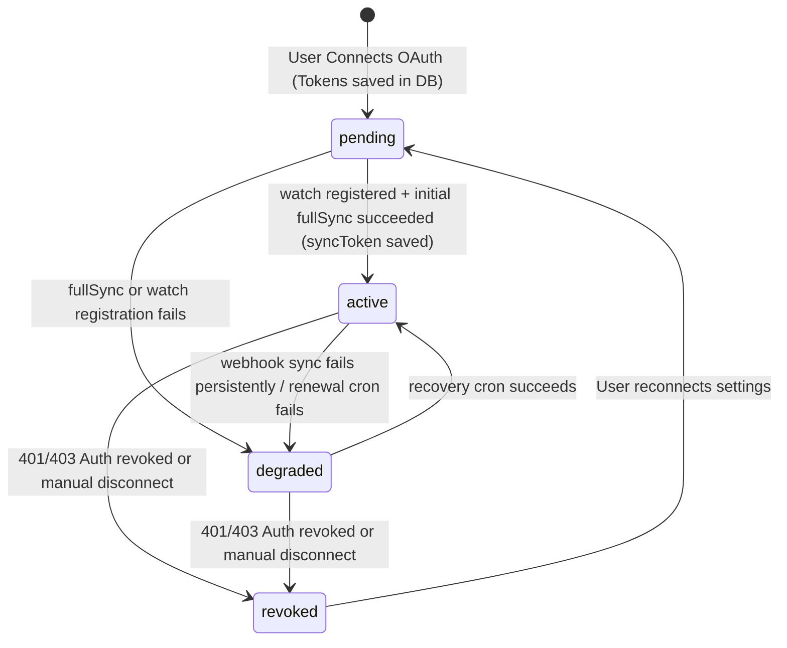

# Google Calendar: 1-Way Sync (Current) → 2-Way Sync (Goal)

---

# Critical Implementation Constraints & Safe Rollout Strategy

## Mandatory Engineering Rules

This project upgrades an already working production Google Calendar integration from 1-way sync to 2-way sync.

The implementation MUST preserve all existing functionality and must NOT destabilize the current connector flow.

The primary goal is:

* safely extend the existing architecture
* avoid regressions
* isolate new functionality
* maintain production stability

---

# 1. Existing Functionality Must Remain Untouched

The following existing systems are already working and MUST continue working exactly the same after implementation:

* Google OAuth connect flow
* Google disconnect flow
* Existing 1-way KeilHQ → Google sync
* Existing connector UI and UX
* Existing token refresh flow
* Existing task creation/update flows
* Existing repositories and DB operations
* Existing workers and background jobs

Do NOT:

* rewrite existing sync logic
* refactor unrelated systems
* change existing API contracts
* change existing response payloads
* modify stable production flows unnecessarily

Only extend the architecture safely.

---

# 2. Strict Isolation of New 2-Way Sync Logic

All new 2-way sync functionality must be implemented independently from the current stable outbound sync system.

New functionality should be added as:

* new methods
* new repository methods
* new webhook handlers
* new workers
* new services
* new cron jobs

Avoid modifying existing stable logic unless absolutely necessary.

2-way sync failures must NEVER break:

* task updates
* task creation
* Google connection
* existing outbound sync
* connector UI
* user workflows

Outbound sync must continue working even if:

* webhook registration fails
* webhook delivery fails
* incremental sync fails
* syncToken expires
* Google APIs are temporarily unavailable

---

# 3. OAuth Callback Flow Must Stay Independent

The OAuth callback flow must NEVER depend on:

* watch registration
* webhook setup
* incremental sync
* full sync
* holiday sync
* channel renewal

The OAuth callback should ONLY:

1. validate state
2. exchange auth code for tokens
3. persist tokens
4. redirect success

Everything else must run asynchronously AFTER redirect.

Correct pattern:

```ts
res.redirect(successUrl);

registerWatch(userId).catch(err => {
  console.error('[gcal] watch registration failed:', err);
});
```

Incorrect pattern:

```ts
await registerWatch(userId);
```

A watch registration failure must NEVER prevent a successful Google Calendar connection.

---

# 4. Staged Rollout Is Mandatory

Do NOT implement all 2-way sync functionality at once.

Each phase must be completed and verified independently before moving to the next phase.

---

## Phase 1 — Database & Repository Setup ONLY

Allowed:

* migrations
* repository methods
* helper queries

NOT allowed:

* webhook handlers
* OAuth modifications
* watch registration
* inbound sync
* cron jobs
* task mutations from Google events

After Phase 1:

* existing Google connect/disconnect must still work exactly as before

---

## Phase 2 — Outbound Event Tagging ONLY

Allowed:

* add extendedProperties tagging
* loop prevention metadata

NOT allowed:

* inbound sync
* webhook processing
* Google → KeilHQ mutations

After Phase 2:

* existing 1-way sync behavior must remain unchanged

---

## Phase 3 — Webhook Infrastructure ONLY

Allowed:

* webhook endpoint
* watch registration
* webhook verification
* logging

Webhook events should ONLY log activity initially.

NOT allowed:

* task creation
* task updates
* task deletion

---

## Phase 4 — Incremental Sync Read-Only Validation

Allowed:

* incremental sync processing
* syncToken handling
* event comparison
* logging incoming changes

NOT allowed:

* create/update/delete tasks

This phase exists only for validation and debugging.

---

## Phase 5 — Controlled Google → KeilHQ Mutations

Allowed:

* update existing tasks
* soft-delete tasks
* create tasks from external Google events

Must include:

* idempotency protection
* duplicate prevention
* retry handling
* conflict resolution
* sync loop prevention

---

# 5. Resilience & Fault Tolerance Requirements

All Google API operations must include:

* **Explicit Timeout Policy**: Strict timeout limit of **10,000ms** (10 seconds) on all Google API calls (watch registration, incremental sync, token refresh, and event sync) to prevent worker stalls, queue clogging, and webhook processing backup.
* **Strict Retry Limits**: Exponential backoff up to a maximum of **5 retries** (`maxRetries = 5`).
* **Dead-letter / Graceful Degradation Behavior**: If retries are exhausted, the system must:
  * Log the final failure as a structured critical alert.
  * Mark the user's sync state as degraded in the system.
  * Queue a recovery job to retry later via a scheduled recovery service.
  * Never block task updates, task creation, or break the OAuth connection.
* structured logging

Google API failures must NEVER:

* block task updates
* block task creation
* break OAuth connection
* crash workers
* corrupt DB state

Google sync is a secondary side-effect and must remain non-blocking.

---

# 6. Webhook Security Requirements

The webhook endpoint must validate:

* X-Goog-Channel-ID
* X-Goog-Resource-ID

Never trust webhook headers blindly.

Invalid or unknown webhook requests must be ignored safely.

**CRITICAL:** Reject mismatched channel/resource pairs. When a webhook arrives, verify that the combination of `X-Goog-Channel-ID` and `X-Goog-Resource-ID` matches exactly what was stored during `registerWatch()`. Reject requests where the channel ID is known but the resource ID does not match — this indicates a potential spoofing attempt or stale notification.

---

# 7. Duplicate Prevention & Idempotency

Google may:

* retry webhooks
* send duplicate notifications rapidly
* send delayed notifications

The implementation MUST be fully idempotent.

### 7.1 Webhook Deduplication & Debounce Strategy
Google often sends multiple notifications rapidly for a single user edit. To avoid unnecessary incremental sync spam and database query overhead:
- **Deduplication / Debouncing**: Webhook notifications must NOT immediately execute incremental sync. Instead, they must enqueue a debounced per-user sync job or check a cache/db lock.
- **5-15 Second Window**: Ignore or discard duplicate notification events for the same `userId` / `channelId` arriving within **10 seconds** of an active or recently completed sync run.

### 7.2 DB-Level Uniqueness Enforcement
- **Uniqueness Rule**: Enforce a strict unique constraint in the database on `(owner_user_id, google_event_id)` for personal tasks and `(user_id, google_event_id)` for org tasks to absolutely prevent duplicate creation under concurrent worker executions.
- **Idempotency on Violation**: The create flow must catch database duplicate-key violations (e.g., PostgreSQL `23505` unique violation) and treat them as an **idempotent success**. Instead of throwing an error or crashing the process, the worker must safely fetch the existing task, log a trace, and return gracefully.

Never create duplicate KeilHQ tasks for the same Google event.

---

# 8. Full Sync Safety Limits

All full sync operations must include:

* timeMin
* timeMax
* singleEvents: true

Never fetch full historical calendars.

Only sync:

* today onwards
* next 30 days

**EXPLICIT REQUIREMENT:** The initial sync in `registerWatch()` / `doFullSync()` MUST use the same 30-day window (today → today + 30 days). Do not implement a broad historical fetch. This prevents:

* quota exhaustion
* recurring event explosion
* performance degradation

### 8.1 Recurring Event Strategy Clarification
Google recurring events are extremely complex to synchronize bi-directionally. To prevent bugs and infinite recursion:
- **Limited Scope**: Support for recurring events is **strictly limited to expanded single events** using `singleEvents: true` during the sync window.
- **No Series Sync**: Advanced recurring-series synchronization (e.g., updating a recurring rule or modifying the parent series as a single entity) is explicitly **out of scope** for the MVP.
- **Exception Handling**: Individual exceptions (modifying or deleting a single occurrence of a recurring series on Google Calendar) are handled naturally because `singleEvents: true` expands each occurrence into a separate event with its own distinct `google_event_id`. If an exception is created in Google, it will be sync-updated or soft-deleted in KeilHQ as a standalone task.

---

# 9. Concurrency Protection

Prevent overlapping sync runs for the same user.

The system must avoid:

* race conditions
* duplicate updates
* concurrent incremental sync conflicts

### 9.1 Explicit Per-User Sync Lock Implementation (Postgres native hashtext Advisory Locks)
To ensure only one incremental sync runs per user at any given time, the system must acquire a lock before executing a sync.
- **Strategy**: Use PostgreSQL Advisory Locks with native `hashtext()` mapping. Passing the UUID string directly into the database removes the need for a custom JavaScript integer-hashing helper and eliminates lock collision risks.
- **Connection Isolation (Critical Node.js Pool Guideline)**: Do NOT use `pool.query()` directly for advisory locks because pooled connections are transient and queries can execute on different connections. Always check out a single dedicated connection client from the pool to acquire, hold, and release the lock.
- **Lock Acquisition & Release**:
  ```ts
  const client = await pool.connect();
  try {
    // Attempt to acquire a non-blocking advisory lock atomically using Postgres native hashtext() on UUID string
    const lockResult = await client.query('SELECT pg_try_advisory_lock(hashtext($1))', [userId]);
    const acquired = lockResult.rows[0].pg_try_advisory_lock;
    if (!acquired) {
      console.log(`[gcal] Incremental sync already in progress for user ${userId}. Skipping run.`);
      client.release(); // Return client immediately if lock fails
      return;
    }

    await runSync(client); // Execute sync utilizing the active locked connection
  } finally {
    // Always release the lock and dedicated connection back to the pool
    await client.query('SELECT pg_advisory_unlock(hashtext($1))', [userId]);
    client.release();
  }
  ```

---

# 10. Observability & Debugging Requirements

All sync operations must have structured logs.

Required logs:

* OAuth callback success/failure
* watch registration success/failure
* webhook received
* incremental sync start/end
* imported events
* skipped events
* duplicate prevention
* token refresh failures
* Google API failures

Logs must include:

* userId
* googleEventId
* channelId
* operation type

Never log OAuth tokens.

---

# 11. Backward Compatibility Is Mandatory

No implementation may:

* invalidate existing integrations
* wipe refresh tokens
* reset existing google_event_id mappings
* require unnecessary reconnects

Existing connected users must continue working seamlessly after deployment.

---

# 12. Mandatory Verification After Every Phase

Before marking any phase complete, verify:

* Google connect still works
* Google disconnect still works
* Existing 1-way sync still works
* No connector regressions exist
* No UI regressions exist
* No task update regressions exist
* No DB regressions exist

Production stability must be preserved after every implementation phase.

---

# 13. Transactional Boundaries & Integration State Machine

Multi-step flows such as saving tokens, registering watches, and updating channel/sync metadata can partially fail, leaving the system in an inconsistent or orphaned state. To avoid phantom half-configured integrations:

### 13.1 Explicit Integration State Machine
We introduce a strict status field in `public.user_integrations` to track the state of the Google Calendar sync lifecycle:

* **`watch_status` Enum States**:
  * `'pending'`: The user has connected OAuth and saved tokens, but watch registration/full sync is not yet initialized or completed.
  * `'active'`: The watch has been successfully registered with Google, and the initial full sync completed successfully, securing the first `syncToken`. Only users in `'active'` state are processed on webhook delivery.
  * `'degraded'`: Google watch renewal failed, or the sync process repeatedly failed (e.g. max retries reached). Safe background recovery crons will attempt to restore it.
  * `'revoked'`: The user revoked calendar access (401/403 returned from Google) or disconnected manually. The channel details are stopped and cleared.



### 13.2 Transactional Persistence Rules
Database writes related to integration status updates, watch channel metadata, and `syncToken` updates must be executed within database transactions (`BEGIN` / `COMMIT`) where appropriate.
- **Atomicity Rule**: A user integration must never be assumed `active` until the watch details and the initial `syncToken` are both successfully stored in the database.
- **Transactional Watch Setup**:
  1. Generate unique `channelId` (UUID) in memory.
  2. Register the watch channel via `calendar.events.watch()`.
  3. Run `doFullSync()` to retrieve the first `nextSyncToken`.
  4. Perform the database update inside a transaction:
     * Save `watch_channel_id`, `watch_resource_id`, and `watch_expires_at`.
     * Save `gcal_sync_token` with the token returned from the full sync.
     * Set `watch_status = 'active'`.
  5. If any API calls (watch or full sync) fail, the database update is aborted or rolls back, transitioning the user to `'degraded'` instead of leaving a phantom channel.

---

## Part 1: Current 1-Way Sync — Complete Implementation Detail

### Overview
The system uses a **per-user OAuth 2.0 model**. Every user who wants Google Calendar sync must independently connect their own Google account. The backend stores their OAuth tokens and uses them to push calendar events on their behalf whenever they schedule a task in KeilHQ.

The flow is strictly **one direction: App → Google Calendar**. Nothing ever flows back from Google into KeilHQ.

---

### 1.1 Database Structure

**Table: `public.user_integrations`** (Migration `008_google_calendar_integration.sql`)

| Column | Type | Purpose |
| :--- | :--- | :--- |
| `id` | UUID | Primary key |
| `user_id` | UUID | FK to `public.users(id)`, CASCADE DELETE |
| `provider` | TEXT | Always `'google_calendar'` for now |
| `access_token` | TEXT (nullable) | Short-lived token, expires in ~1 hour |
| `refresh_token` | TEXT (NOT NULL) | Long-lived token, used to get new access tokens |
| `token_expiry` | TIMESTAMPTZ (nullable) | When the current access token expires |
| `calendar_id` | TEXT | Which Google calendar to sync to, defaults to `'primary'` |
| `created_at` | TIMESTAMPTZ | When user first connected |
| `updated_at` | TIMESTAMPTZ | Auto-updated by trigger |
| UNIQUE | `(user_id, provider)` | One row per user per provider |

**Column: `google_event_id`** on both `public.tasks` and `public.personal_tasks`
- This is the critical link between a KeilHQ task and a Google Calendar event.
- It is `NULL` when the task has never been synced to Google.
- It is populated after the first sync with the event's ID returned by the Google Calendar API.
- It is set back to `NULL` when the task is unscheduled or the Google event is deleted.

---

### 1.2 OAuth Connection Flow (Step-by-Step)

This is how a user connects their Google Calendar for the first time.

**Step 1 — User clicks "Connect" in Settings**
- Frontend calls `GET /api/v1/integrations/google/connect` with the user's JWT.
- Controller (`integration.controller.ts`) calls `getAuthUrl(userId)` from the Google Calendar service.

**Step 2 — Backend generates a secure OAuth URL**
- `getAuthUrl(userId)` in `google-calendar.service.ts` creates an `OAuth2Client` using `GOOGLE_CLIENT_ID`, `GOOGLE_CLIENT_SECRET`, and `GOOGLE_REDIRECT_URI`.
- A **signed state parameter** is generated for CSRF protection:
  1. A JSON payload `{ userId, ts: Date.now() }` is base64-encoded.
  2. This payload is then signed with `HMAC-SHA256` using the `GOOGLE_OAUTH_STATE_SECRET` env variable.
  3. The final state string is `"{base64payload}.{hmacSignature}"`.
- The OAuth URL is generated with scope `https://www.googleapis.com/auth/calendar.events`, `access_type: 'offline'`, and `prompt: 'consent'` (to always force Google to return a refresh token).
- The URL is returned to the frontend as `{ url: "https://accounts.google.com/..." }`.

**Step 3 — User is redirected to Google**
- Frontend does `window.location.href = url` — a full page redirect to Google's consent screen.

**Step 4 — User approves access on Google's consent screen**
- Google redirects the user's browser to `GOOGLE_REDIRECT_URI` (which is the backend endpoint `GET /api/v1/integrations/google/callback`) with two query params: `?code=AUTH_CODE&state=SIGNED_STATE`.

**Step 5 — Backend handles the callback**
- `handleCallback(code, state)` in `google-calendar.service.ts`:
  1. **Verifies the HMAC signature** on the state to prevent CSRF attacks. If the signature doesn't match, it throws an error.
  2. **Decodes the userId** from the base64 payload.
  3. **Exchanges the auth code** for tokens by calling `oauth2Client.getToken(code)`, which returns `{ access_token, refresh_token, expiry_date }`.
  4. If `refresh_token` is missing (can happen if the user already granted access before and didn't revoke it), it throws an error telling the user to revoke and reconnect.
  5. **Saves tokens** to `user_integrations` via `integrationRepository.upsert()`, which uses `ON CONFLICT (user_id, provider) DO UPDATE` to handle reconnections gracefully.
- The controller then **redirects the user** back to the frontend at `/tasks?gcal=connected`.

**Step 6 — Frontend shows success toast**
- The frontend detects the `?gcal=connected` query param and shows a success toast.

---

### 1.3 Task Sync Flow (The Core Logic)

This is triggered whenever a task is updated (rescheduled, renamed, deleted, etc.).

**Where is sync triggered?**

Currently, `syncTaskToCalendar()` is called in **two places**:
1. `personal-task.service.ts` → `updatePersonalTask()` — after a personal task is updated in the DB.
2. `task.service.ts` → `updateTask()` — (for workspace/legacy tasks).

> **⚠️ Known Bug:** `syncTaskToCalendar` is NOT called after `createPersonalTask()`. So a brand new personal task never gets pushed to Google Calendar until the user edits it for the first time.

**How is it called?**
```typescript
// Fire-and-forget — the task update is NOT delayed waiting for Google
syncTaskToCalendar(userId, { ...task, source: 'personal_tasks' })
  .catch(err => console.error('[gcal] sync failed:', err.message));
```
The sync is **fire-and-forget** — it never blocks the HTTP response. If Google is down, the task is still saved in your DB successfully.

---

### 1.4 Inside `syncTaskToCalendar()` — Decision Tree

```
syncTaskToCalendar(userId, task)
│
├── Does task have a start_date?
│   └── NO:
│       ├── Does it have a google_event_id?
│       │   └── YES → deleteCalendarEvent(userId, google_event_id)
│       │           → UPDATE tasks SET google_event_id = NULL WHERE id = task.id
│       └── Return (nothing to push)
│
├── Get authorized OAuth client for this user
│   └── Returns NULL? → Return silently (user not connected or token revoked)
│
├── Build the Google Calendar event body:
│   ├── is_all_day = TRUE →
│   │   start: { date: "YYYY-MM-DD" }  ← no time component
│   │   end:   { date: "YYYY-MM-DD" }  ← due_date, or start+1day if no due_date
│   └── is_all_day = FALSE →
│       start: { dateTime: "ISO string" }
│       end:   { dateTime: "ISO string" }  ← due_date, or start+1hour if no due_date
│
├── Does task already have a google_event_id?
│   ├── YES → calendar.events.update(calendarId, eventId, body)
│   └── NO  → calendar.events.insert(calendarId, body)
│             → Save returned event.id back: UPDATE tasks SET google_event_id = event.id
│
└── On 404/410 error from Google (event was deleted in Google directly):
    → Clear google_event_id: UPDATE tasks SET google_event_id = NULL
```

---

### 1.5 Token Refresh (Transparent Auto-Refresh)

Inside `getAuthorizedClient(userId)`:
1. Loads the integration row from DB.
2. Checks if `token_expiry` is within 5 minutes of now.
3. If yes, calls `oauth2Client.refreshAccessToken()` to get a new short-lived access token.
4. Saves the new `access_token` and `token_expiry` back to `user_integrations`.
5. If the refresh call fails (e.g., user revoked access in Google settings), it logs the error and returns `null`, causing sync to be silently skipped.

---

### 1.6 `IntegrationRepository` — 4 Methods

| Method | SQL | When Used |
| :--- | :--- | :--- |
| `findByUserAndProvider(userId, provider)` | SELECT | Before every sync, in `getAuthorizedClient` |
| `upsert(userId, provider, data)` | INSERT … ON CONFLICT DO UPDATE | On OAuth callback success |
| `updateTokens(userId, provider, token, expiry)` | UPDATE | After auto token refresh |
| `delete(userId, provider)` | DELETE | When user clicks "Disconnect" |

---

## Part 2: What is 2-Way Sync?

**Current state (1-way):** KeilHQ → Google Calendar only.
- You schedule a task in KeilHQ → it appears in Google Calendar. ✅
- You move the event in Google Calendar → KeilHQ doesn't know. ❌

**2-way sync:** Both directions work simultaneously.
- KeilHQ → Google: Same as now (already done). ✅
- Google → KeilHQ: If you move, rename, or delete an event in Google Calendar (from phone, another app, or directly on calendar.google.com), that change is automatically reflected in KeilHQ. ✅ (To be built)

---

## Part 3: How to Implement 2-Way Sync

There are two approaches Google supports. You need to understand both.

### Approach A: Polling (Simple but Inefficient)
- Every few minutes, your backend fetches all events from Google Calendar for all connected users and compares them with your DB.
- **Problem:** If you have 1000 users, you're making 1000 API calls every few minutes. Google will rate-limit you. This is not scalable.

### Approach B: Push Notifications (Webhook) — Correct Approach

Google's Calendar API supports **Push Notifications** (also called "Channel Watch"). Here's how it works:

1. **Your backend registers a "Watch"** on a user's calendar by calling `calendar.events.watch()`. You give Google a URL (your webhook endpoint) and it gives you back a `channelId` and a `resourceId`.
2. **Google calls your webhook** every time anything changes on that calendar (event created, moved, renamed, deleted).
3. **Your backend processes the notification**, figures out what changed, and updates your DB accordingly.

The webhook notification from Google does NOT tell you what changed — it only tells you "something changed". You then have to fetch the changes yourself using a `syncToken` (explained below).

---

## Part 4: Edge Cases

This is the section that makes 2-way sync hard. You must handle every one of these:

### Edge Case 1: The Sync Loop (Most Critical)
- **Scenario:** User updates a task in KeilHQ → KeilHQ pushes change to Google → Google detects a change on the calendar → Google calls your webhook → Your backend updates the task in KeilHQ → KeilHQ pushes to Google again → **Infinite loop**.
- **Solution (Two-Pronged Guard)**:
  1. **Google Event Tagging (`extendedProperties`)**: When KeilHQ creates or updates a Google event, it sets a private extended property `{ private: { source: "keilhq", taskId: "..." } }`. On webhook events, we inspect this property. If it matches `'keilhq'`, the incoming Google event is skipped.
  2. **Inbound Retrigger Suppression (`skipGoogleSync` update flag/context)**: Extended properties alone are not enough if the database update triggers standard service/repository hooks that automatically enqueue an outbound `syncTaskToCalendar()` call. To prevent this "sync echo", all repository/service update methods (e.g., `personalTaskRepository.update()` and `orgTaskRepository.update()`) must accept an options/context parameter containing a `skipGoogleSync: true` flag. The outbound sync listener or scheduler must intercept this flag and abort immediately if the update originated from Google Calendar. This suppresses the outbound retrigger at the source.

### Edge Case 2: Watch Channel Expiration
- Google's push notification channels have a **maximum TTL of 7 days**. After 7 days, Google stops sending notifications.
- **Solution:** You must store the channel expiry date and set up a **cron job** that renews all channels that expire within 24 hours by calling `calendar.events.watch()` again.

### Edge Case 3: `syncToken` Expiration
- The `syncToken` (used for incremental sync, see Step 5 in implementation) also expires, typically after **a few days of inactivity**.
- **Solution:** When Google returns a `410 Gone` error for an expired `syncToken`, you must do a **full sync** (fetch all events from scratch) and get a fresh `syncToken`.

### Edge Case 4: Event Created in Google has No Matching KeilHQ Task
- **Scenario:** User creates a new event directly in Google Calendar (not from KeilHQ). Google fires a webhook. Your backend has no task with a matching `google_event_id`.
- **Decision you must make:** Should you create a new KeilHQ task for this Google event? Or ignore it?
- **Decision:** As per the finalized product decisions, we will **create a new Personal Task** in KeilHQ for events created externally in Google, provided they fall within the 30-day sync window.

### Edge Case 5: An Event is Deleted in Google
- The webhook fires. You fetch the events. The event is marked with `status: 'cancelled'` in the Google API response (Google never hard-deletes events from the sync feed — it marks them cancelled).
- **Decision:** We will **soft-delete the matching KeilHQ task** (set `deleted_at`) but keep the record in our DB.

### Edge Case 6: Conflict Resolution (Both Sides Changed)
- **Scenario:** User updates the task in KeilHQ (offline or quickly), and also moves the event in Google at the same time.
- **Solution:** Use **"last write wins"** based on `updated_at`. Compare the task's `updated_at` timestamp in your DB with the event's `updated` timestamp from the Google API. Whichever is newer wins.

### Edge Case 7: User Revokes Access in Google
- The user goes to their Google account settings and manually revokes KeilHQ's calendar access.
- The next time `getAuthorizedClient()` tries to refresh the token, it will fail.
- **Current behavior:** Already handled — it returns `null` and sync is silently skipped.
- **Additional step needed for 2-way sync:** The watch channel for that user will also stop working. You need to detect the revocation (via a `401` on the watch call) and clean up the `user_integrations` row.

### Edge Case 8: Google Webhook Verification
- Google will send a first **sync message** to your webhook endpoint immediately after you register a watch. This is a `HEAD` or `POST` request with a `X-Goog-Resource-State: sync` header. Your endpoint must respond with `200 OK` to confirm the webhook URL is valid.
- **Solution:** Add a check at the top of your webhook handler for `X-Goog-Resource-State: sync` and return 200 immediately.

### Edge Case 9: Webhook Receives Events for Multiple Users
- Each user has their own watch channel (registered with their own `channelId`).
- Google sends each notification with a `X-Goog-Channel-ID` header which matches the `channelId` you registered.
- **Solution:** You must look up which user owns that `channelId` and fetch changes using that user's OAuth token.

---

## Part 5: Why is This Hard?

1. **Your webhook endpoint must be publicly reachable by Google.** During development, `localhost` doesn't work. You need a tool like `ngrok` to expose your local server, or you deploy to a staging server. This makes local testing very slow.

2. **Google doesn't tell you WHAT changed**, only that SOMETHING changed. You have to do a second API call (with the `syncToken`) to find out what. This is two network hops per notification.

3. **You can't test it easily.** To trigger the webhook, you have to actually make a change in Google Calendar and wait for the notification. You can't unit test the full flow without mocking the entire Google API.

4. **The sync loop problem has no "clean" solution.** Extended properties are the standard approach but they add complexity to every single push operation you do.

5. **Channel renewal is an operational concern.** It's easy to forget that channels expire in 7 days and suddenly all your 2-way sync silently breaks for all users.

6. **Token expiry interacts with everything.** You need a valid OAuth token to both receive (watch) and process (fetch) changes. Token refresh can fail at any point.

---

## Part 6: Step-by-Step Implementation Guide (Backend Only)

### Step 1 — Database Migration (New file: `009_gcal_two_way_sync.sql`)

Add status enums, columns, webhook receipts table, and uniqueness constraints to support watch lifecycle states, debouncing, state tracking, stable iCalUID mappings, and replay protection:

```sql
-- 1. Create watch status enum and add channel management & state tracking columns
CREATE TYPE public.gcal_watch_status AS ENUM ('pending', 'active', 'degraded', 'revoked');

ALTER TABLE public.user_integrations
  ADD COLUMN IF NOT EXISTS watch_status              public.gcal_watch_status DEFAULT 'pending',
  ADD COLUMN IF NOT EXISTS watch_channel_id          TEXT,
  ADD COLUMN IF NOT EXISTS watch_resource_id         TEXT,
  ADD COLUMN IF NOT EXISTS watch_expires_at          TIMESTAMPTZ,
  ADD COLUMN IF NOT EXISTS gcal_sync_token           TEXT,
  ADD COLUMN IF NOT EXISTS last_sync_at              TIMESTAMPTZ,
  ADD COLUMN IF NOT EXISTS sync_in_progress          BOOLEAN DEFAULT FALSE,
  ADD COLUMN IF NOT EXISTS last_sync_error           TEXT,
  ADD COLUMN IF NOT EXISTS last_successful_sync_at   TIMESTAMPTZ;

-- Index for fast lookup by channel_id on webhook arrival
CREATE INDEX IF NOT EXISTS idx_user_integrations_channel_id
  ON public.user_integrations(watch_channel_id)
  WHERE watch_channel_id IS NOT NULL;

-- 2. Add stable iCalUID column to support organizer moving and ownership edge cases
ALTER TABLE public.personal_tasks
  ADD COLUMN IF NOT EXISTS ical_uid TEXT;

ALTER TABLE public.tasks
  ADD COLUMN IF NOT EXISTS ical_uid TEXT;

CREATE INDEX IF NOT EXISTS idx_personal_tasks_ical_uid ON public.personal_tasks(ical_uid);
CREATE INDEX IF NOT EXISTS idx_tasks_ical_uid ON public.tasks(ical_uid);

-- 3. Enforce DB-level uniqueness rules to prevent duplicate tasks from concurrent runs/webhook retries
ALTER TABLE public.personal_tasks
  ADD CONSTRAINT uq_personal_tasks_user_google_event UNIQUE (owner_user_id, google_event_id);

ALTER TABLE public.tasks
  ADD CONSTRAINT uq_tasks_user_google_event UNIQUE (user_id, google_event_id);

-- 4. Create webhook receipts table to enforce replay protection and message idempotency
CREATE TABLE IF NOT EXISTS public.gcal_webhook_receipts (
  id              UUID PRIMARY KEY DEFAULT gen_random_uuid(),
  channel_id      TEXT NOT NULL,
  resource_id     TEXT NOT NULL,
  message_number  BIGINT NOT NULL,
  received_at     TIMESTAMPTZ NOT NULL DEFAULT NOW(),
  UNIQUE(channel_id, resource_id, message_number)
);
```

| New Column / Constraint / Table | Purpose |
| :--- | :--- |
| `watch_status` | Custom ENUM tracking watch states (`pending`, `active`, `degraded`, `revoked`). |
| `watch_channel_id` | UUID generated during watch registration. Identifies which user a webhook notification belongs to. |
| `watch_resource_id` | Returned by Google on `events.watch()`. Required to stop/unsubscribe the watch channel. |
| `watch_expires_at` | Expiration date of the current watch (7 days max TTL). Must be renewed. |
| `gcal_sync_token` | Incremental sync state token returned by Google's Calendar API. |
| `last_sync_at` | Webhook debounce cooldown timestamp. |
| `sync_in_progress` | Operational state flag indicating active background sync executions. |
| `last_sync_error` | Persisted error message from the most recent failed sync. |
| `last_successful_sync_at` | Timestamp of the last fully completed sync. Used for health tooling. |
| `ical_uid` | Maps Google's `iCalUID` which remains stable across event moves, calendar transfers, and copy/paste. |
| `uq_personal_tasks_user_google_event` | Unique constraint to prevent duplicate personal tasks for a user's Google event ID. |
| `uq_tasks_user_google_event` | Unique constraint to prevent duplicate team/org tasks for a user's Google event ID. |
| `gcal_webhook_receipts` | Tracks unique webhook message numbers (`X-Goog-Message-Number`) to prevent replay attacks. |

---

### Step 2 — Add 3 New Methods to `IntegrationRepository`

```typescript
// Save watch channel details after registering a watch with Google
saveWatchChannel(userId: string, provider: string, data: {
  channelId: string;
  resourceId: string;
  expiresAt: Date;
}): Promise<void>

// Look up a user by their watch channelId (called on every webhook hit)
findByChannelId(channelId: string): Promise<UserIntegration | null>

// Save the syncToken returned by Google after processing changes
saveSyncToken(userId: string, provider: string, syncToken: string): Promise<void>

// Clear watch channel details (called on disconnect or revocation)
clearWatchChannel(userId: string, provider: string): Promise<void>
```

---

### Step 3 — Add `registerWatch()` to `google-calendar.service.ts`

This function is called **once per user** after they connect their Google Calendar. It includes channel cleanup (stopping old watch channels) and strict timeout configurations.

```typescript
export async function registerWatch(userId: string): Promise<void> {
  const authClient = await getAuthorizedClient(userId);
  if (!authClient) return;

  const integration = await integrationRepository.findByUserAndProvider(userId, PROVIDER);
  if (!integration) return;

  const calendar = google.calendar({ version: 'v3', auth: authClient });
  
  // Set explicit 10-second timeout policy on Google API requests
  calendar.context._options.timeout = 10000;

  // --- Watch Channel Cleanup ---
  // If an old watch channel exists in the database, stop it first to prevent orphaned channels and duplicate notifications
  if (integration.watch_channel_id && integration.watch_resource_id) {
    try {
      console.log(`[gcal] Stopping old watch channel ${integration.watch_channel_id} before registering a new one.`);
      await calendar.channels.stop({
        requestBody: {
          id: integration.watch_channel_id,
          resourceId: integration.watch_resource_id,
        },
      });
    } catch (stopErr: any) {
      console.warn(`[gcal] Failed to stop old watch channel ${integration.watch_channel_id}:`, stopErr.message);
    }
  }

  const channelId = uuidv4(); // generate a unique ID for this watch channel
  const ttlMs = 7 * 24 * 60 * 60 * 1000; // 7 days in milliseconds

  // --- Watch Registration Advisory Lock (Idempotency) ---
  // Acquire a watch-setup-specific advisory lock to prevent concurrent reconnects from registering duplicate active channels
  const watchLockKey = `gcal-watch:${userId}`;
  const lockClient = await pool.connect();
  
  try {
    const lockRes = await lockClient.query('SELECT pg_try_advisory_lock(hashtext($1))', [watchLockKey]);
    if (!lockRes.rows[0].pg_try_advisory_lock) {
      console.log(`[gcal] Watch registration already in progress for user ${userId}. Skipping redundant setup.`);
      lockClient.release();
      return;
    }

    // Set official googleapis request timeout policy globally/instance-level (stable API approach)
    google.options({ timeout: 10000 });

    // 1. Call Google Calendar API to watch events
    const response = await calendar.events.watch({
      calendarId: integration.calendar_id || 'primary',
      requestBody: {
        id: channelId,
        type: 'web_hook',
        address: `${config.backendUrl}/api/v1/integrations/google/webhook`,
        expiration: String(Date.now() + ttlMs),
      },
    });

    // 2. Perform safe full initial sync within transaction context to get the first syncToken
    const initialSyncToken = await doFullSync(userId, integration.calendar_id || 'primary', authClient);

    // 3. Atomically persist watch channel metadata and transition watch_status to 'active' inside a DB transaction
    await pool.query('BEGIN');
    try {
      await pool.query(
        `UPDATE public.user_integrations
         SET watch_channel_id = $1,
             watch_resource_id = $2,
             watch_expires_at = $3,
             gcal_sync_token = $4,
             watch_status = 'active'::public.gcal_watch_status
         WHERE user_id = $5`,
        [channelId, response.data.resourceId!, new Date(Date.now() + ttlMs), initialSyncToken, userId]
      );
      await pool.query('COMMIT');
    } catch (dbErr) {
      await pool.query('ROLLBACK');
      throw dbErr;
    }

  } catch (err: any) {
    console.error(`[gcal] registerWatch failed for user ${userId}:`, err.message);
    
    // Mark watch channel as degraded in database atomically to avoid phantom active states
    await pool.query(
      `UPDATE public.user_integrations
       SET watch_status = 'degraded'::public.gcal_watch_status
       WHERE user_id = $1`,
      [userId]
    );
    throw err;
  } finally {
    // Release advisory lock and dedicated setup connection client
    await lockClient.query('SELECT pg_advisory_unlock(hashtext($1))', [watchLockKey]);
    lockClient.release();
  }
}
```

---

### Step 4 — Add `doFullSync()` and `doIncrementalSync()` to `google-calendar.service.ts`

**`doFullSync()`** — Called once when a watch is first registered, or when a `syncToken` expires (410 error). Returns the fresh `syncToken`:
```typescript
async function doFullSync(userId: string, calendarId: string, authClient: OAuth2Client): Promise<string | undefined> {
  const calendar = google.calendar({ version: 'v3', auth: authClient });
  
  // Fetch events within the 30-day sync window (today → today + 30 days)
  // This prevents quota exhaustion and recurring event explosion
  const now = new Date();
  const thirtyDaysFromNow = new Date(now.getTime() + 30 * 24 * 60 * 60 * 1000);
  
  let pageToken: string | undefined;
  let syncToken: string | undefined;

  do {
    const response = await calendar.events.list({
      calendarId,
      singleEvents: true,
      timeMin: now.toISOString(),
      timeMax: thirtyDaysFromNow.toISOString(),
      pageToken,
    });
    
    // Process events — we now import events that aren't already in KeilHQ
    for (const event of response.data.items ?? []) {
      await processIncomingGoogleEvent(userId, event);
    }
    
    pageToken = response.data.nextPageToken ?? undefined;
    syncToken = response.data.nextSyncToken ?? undefined;
  } while (pageToken);

  return syncToken;
}
```

**`doIncrementalSync()`** — Called every time a webhook fires for this user (configured with a dedicated connection client, operational state tracking, revocation cleanup, and timeout controls):
```typescript
export async function doIncrementalSync(userId: string): Promise<void> {
  // 1. Check out dedicated pool connection to prevent transaction/session lock leakage across other pool queries
  const lockClient = await pool.connect();
  
  try {
    // 2. Acquire non-blocking advisory lock atomically using Postgres native hashtext() on UUID string
    const lockResult = await lockClient.query('SELECT pg_try_advisory_lock(hashtext($1))', [userId]);
    const acquired = lockResult.rows[0].pg_try_advisory_lock;
    if (!acquired) {
      console.log(`[gcal] Incremental sync already in progress for user ${userId}. Skipping this run.`);
      lockClient.release(); // release back immediately if lock fails
      return;
    }

    const authClient = await getAuthorizedClient(userId);
    if (!authClient) return;

    const integration = await integrationRepository.findByUserAndProvider(userId, PROVIDER);
    // Only process webhook events if the integration watch_status is active
    if (!integration || integration.watch_status !== 'active' || !integration.gcal_sync_token) return;

    // Track active sync state in DB
    await pool.query(
      `UPDATE public.user_integrations SET sync_in_progress = TRUE, last_sync_error = NULL WHERE user_id = $1`,
      [userId]
    );

    const calendar = google.calendar({ version: 'v3', auth: authClient });
    
    // Set official request timeout policy globally/instance-level (stable API approach)
    google.options({ timeout: 10000 });

    try {
      const response = await calendar.events.list({
        calendarId: integration.calendar_id || 'primary',
        syncToken: integration.gcal_sync_token,
      });

      // Process each changed event
      for (const event of response.data.items ?? []) {
        await processIncomingGoogleEvent(userId, event);
      }

      // Save the new syncToken for the next incremental sync
      if (response.data.nextSyncToken) {
        await integrationRepository.saveSyncToken(userId, PROVIDER, response.data.nextSyncToken);
      }

      // Sync success state update
      await pool.query(
        `UPDATE public.user_integrations 
         SET sync_in_progress = FALSE, last_sync_error = NULL, last_successful_sync_at = NOW() 
         WHERE user_id = $1`,
        [userId]
      );

    } catch (err: any) {
      // 3. Graceful 401/403 Revocation Cleanup
      // If the OAuth authorization is revoked (401, 403, or invalid_grant), immediately tear down credentials and status
      if (err?.code === 401 || err?.code === 403 || err?.response?.data?.error === 'invalid_grant') {
        console.warn(`[gcal] Authorization credentials revoked (Code: ${err?.code}) for user ${userId}. Cleaning up watch channel.`);
        await pool.query(
          `UPDATE public.user_integrations
           SET watch_status = 'revoked'::public.gcal_watch_status,
               watch_channel_id = NULL,
               watch_resource_id = NULL,
               watch_expires_at = NULL,
               gcal_sync_token = NULL,
               sync_in_progress = FALSE,
               last_sync_error = $1
           WHERE user_id = $2`,
          [`Google OAuth credentials revoked: ${err.message}`, userId]
        );
        return;
      }

      if (err?.code === 410) {
        console.warn(`[gcal] syncToken expired/invalid (410 Gone) for user ${userId}. Clearing token and initiating full resync.`);
        await integrationRepository.saveSyncToken(userId, PROVIDER, null);
        
        const freshSyncToken = await doFullSync(userId, integration.calendar_id || 'primary', authClient);
        if (freshSyncToken) {
          await integrationRepository.saveSyncToken(userId, PROVIDER, freshSyncToken);
        }
      } else {
        // Update operational sync error
        await pool.query(
          `UPDATE public.user_integrations SET sync_in_progress = FALSE, last_sync_error = $1 WHERE user_id = $2`,
          [err.message, userId]
        );
        throw err;
      }
    }
  } finally {
    // 4. Always release advisory lock and return connection client back to pool
    await lockClient.query('SELECT pg_advisory_unlock(hashtext($1))', [userId]);
    lockClient.release();
  }
}

---

### Step 5 — Add `processIncomingGoogleEvent()` — The Core Inbound Logic

```typescript
async function processIncomingGoogleEvent(userId: string, event: calendar_v3.Schema$Event): Promise<void> {
  // --- SYNC LOOP PREVENTION ---
  // If this event was pushed by KeilHQ, skip it to avoid an infinite loop.
  const source = event.extendedProperties?.private?.source;
  if (source === 'keilhq') return;

  const googleEventId = event.id;
  const icalUid = event.iCalUID;
  if (!googleEventId) return;

  // --- SYNC WINDOW FILTER ---
  // Ensure that even on incremental resync, we discard historical/future events outside our 30-day window
  const now = new Date();
  const thirtyDaysFromNow = new Date(now.getTime() + 30 * 24 * 60 * 60 * 1000);
  
  const isAllDay = !!event.start?.date;
  const startDate = isAllDay ? new Date(event.start!.date!) : new Date(event.start!.dateTime!);
  const dueDate = isAllDay ? new Date(event.end!.date!) : new Date(event.end!.dateTime!);

  if (startDate < now || startDate > thirtyDaysFromNow) {
    console.log(`[gcal] Event ${googleEventId} falls outside current sync window. Skipping processing.`);
    return;
  }

  // Find if we have a matching task in our DB by either googleEventId OR stable iCalUID (covers moved events)
  const matchingTask = await findTaskByGoogleEventIdOrIcalUid(googleEventId, icalUid);

  if (!matchingTask) {
    // Edge Case 4: Event not created by us — CREATE as Personal Task
    try {
      await personalTaskRepository.create({
        owner_user_id: userId,
        title: event.summary || 'Untitled Google Event',
        start_date: startDate,
        due_date: dueDate,
        google_event_id: googleEventId,
        ical_uid: icalUid,
        status: 'backlog', // Default status
        priority: 'medium', // Default priority
      });
    } catch (err: any) {
      // Enforce DB-level uniqueness and handle duplicate key errors as idempotent success
      if (err.code === '23505') { // PostgreSQL unique_violation
        console.warn(`[gcal] Duplicate task detected for googleEventId ${googleEventId} during concurrent insert. Treating as idempotent success.`);
        return;
      }
      throw err;
    }
    return;
  }

  // Edge Case 5: Event was deleted in Google
  if (event.status === 'cancelled') {
    // Soft-delete the matching KeilHQ task as per product decision
    await softDeleteTask(matchingTask.id, matchingTask.source);
    return;
  }

  const newTitle = event.summary ?? matchingTask.title;

  // --- PREVENT INFINITE "TIMESTAMP UPDATE WARS" ---
  // Skip DB write entirely if values are identical to avoid pointless writes and unnecessary outbound suppression logic
  const sameDates = (d1: Date | string, d2: Date | string) => new Date(d1).getTime() === new Date(d2).getTime();
  if (matchingTask.title === newTitle && sameDates(matchingTask.start_date, startDate) && sameDates(matchingTask.due_date, dueDate)) {
    console.log(`[gcal] Task ${matchingTask.id} details are identical to event updates. Skipping redundant database write.`);
    return;
  }

  // --- Conflict Resolution: Last Write Wins with 5-Second Tolerance Window ---
  const googleUpdatedAt = new Date(event.updated!);
  const ourUpdatedAt = new Date(matchingTask.updated_at);

  const timeDifferenceMs = Math.abs(googleUpdatedAt.getTime() - ourUpdatedAt.getTime());
  const toleranceMs = 5000; // 5-second window to resolve minor clock skews

  if (googleUpdatedAt <= ourUpdatedAt || timeDifferenceMs < toleranceMs) {
    // Our version is newer or within the 5-second tolerance skew window — ignore Google's update
    console.log(`[gcal] Conflicting update ignored due to tolerance skew window (diff: ${timeDifferenceMs}ms) or older timestamp.`);
    return;
  }

  // Google's version is newer — update our task with skipGoogleSync context to suppress outbound loop retriggers
  if (matchingTask.source === 'personal_tasks') {
    await personalTaskRepository.update(matchingTask.id, {
      title: newTitle,
      start_date: startDate,
      due_date: dueDate,
    }, { skipGoogleSync: true });
  } else {
    await orgTaskRepository.update(matchingTask.id, {
      title: newTitle,
      start_date: startDate,
      due_date: dueDate,
    }, { skipGoogleSync: true });
  }
}
```

---

### Step 5.1 — New Helper Functions

These helpers are required to manage the link between Google Events and KeilHQ tasks across both `tasks` (Org) and `personal_tasks` tables.

```typescript
async function findTaskByGoogleEventIdOrIcalUid(googleEventId: string, icalUid?: string): Promise<{ id: string, source: 'tasks' | 'personal_tasks', title: string, updated_at: Date, start_date: Date, due_date: Date } | null> {
  // 1. Search in Personal Tasks using both google_event_id and stable ical_uid
  const personalResult = await pool.query(
    `SELECT id, title, updated_at, start_date, due_date FROM public.personal_tasks 
     WHERE google_event_id = $1 OR (ical_uid IS NOT NULL AND ical_uid = $2)`,
    [googleEventId, icalUid]
  );
  if (personalResult.rows.length > 0) {
    return { ...personalResult.rows[0], source: 'personal_tasks' };
  }

  // 2. Search in Org Tasks
  const orgResult = await pool.query(
    `SELECT id, title, updated_at, start_date, due_date FROM public.tasks 
     WHERE google_event_id = $1 OR (ical_uid IS NOT NULL AND ical_uid = $2)`,
    [googleEventId, icalUid]
  );
  if (orgResult.rows.length > 0) {
    return { ...orgResult.rows[0], source: 'tasks' };
  }

  return null;
}

async function softDeleteTask(id: string, source: 'tasks' | 'personal_tasks'): Promise<void> {
  const table = source === 'tasks' ? 'public.tasks' : 'public.personal_tasks';
  await pool.query(
    `UPDATE ${table} SET deleted_at = NOW(), google_event_id = NULL WHERE id = $1`,
    [id]
  );
}

async function clearGoogleEventId(id: string, source: 'tasks' | 'personal_tasks'): Promise<void> {
  const table = source === 'tasks' ? 'public.tasks' : 'public.personal_tasks';
  await pool.query(
    `UPDATE ${table} SET google_event_id = NULL WHERE id = $1`,
    [id]
  );
}
```

---

### Step 6 — Update `syncTaskToCalendar()` to Tag Events & Prevent Echo Loops

Add both the `skipGoogleSync` check and the `extendedProperties` tagging to prevent any loop retriggering:

```typescript
export async function syncTaskToCalendar(userId: string, task: Task, options?: { skipGoogleSync?: boolean }): Promise<void> {
  // --- INBOUND SYNC LOOP RETRIGGER SUPPRESSION ---
  // If the update originated from an inbound Google update (processIncomingGoogleEvent), skip pushing it back!
  if (options?.skipGoogleSync) {
    console.log(`[gcal] Suppressing outbound sync for task ${task.id} to avoid loop echo.`);
    return;
  }

  const authClient = await getAuthorizedClient(userId);
  if (!authClient) return;

  const calendar = google.calendar({ version: 'v3', auth: authClient });
  google.options({ timeout: 10000 }); // Strict 10s timeout policy (stable googleapis way)

  const body = {
    summary: task.title,
    // ... start, end dates
    extendedProperties: {
      private: {
        source: 'keilhq',      // Identifies events created/updated by us
        taskId: task.id,        // Links to the KeilHQ task ID
      }
    }
  };

  // ... execute update/insert
}
```

This is the fix for **Edge Case 1 (Sync Loop)**.

---

### Step 7 — Add Webhook Handler to `integration.controller.ts`

This handler enforces security checks (verifying `X-Goog-Resource-ID`) and implements a 10-second webhook deduplication/debounce strategy.

```typescript
export const handleGoogleWebhook = async (req: Request, res: Response): Promise<void> => {
  // Step 1: Always respond 200 immediately. Google will retry if you are slow.
  res.status(200).send();

  // Step 2: Handle Google's initial sync verification ping
  const resourceState = req.headers['x-goog-resource-state'];
  if (resourceState === 'sync') return; // Just a verification ping, ignore

  // Step 3: Identify which user this notification is for
  const channelId = req.headers['x-goog-channel-id'] as string;
  const resourceId = req.headers['x-goog-resource-id'] as string;
  const messageNumberStr = req.headers['x-goog-message-number'] as string;
  if (!channelId || !resourceId || !messageNumberStr) return;

  const integration = await integrationRepository.findByChannelId(channelId);
  if (!integration) return; // Unknown channel, ignore

  // --- CRITICAL SECURITY CHECK ---
  // Reject mismatched channel/resource pairs indicating potential spoofing or stale channels
  if (integration.watch_resource_id !== resourceId) {
    console.warn(`[gcal] Mismatched resource ID ${resourceId} for channel ${channelId}. Discarding webhook.`);
    return;
  }

  // --- WEBHOOK REPLAY PROTECTION ---
  // Enforce message-level idempotency by atomically recording webhook receipts. Reject duplicates immediately.
  const messageNumber = BigInt(messageNumberStr);
  try {
    await pool.query(
      `INSERT INTO public.gcal_webhook_receipts (channel_id, resource_id, message_number)
       VALUES ($1, $2, $3)`,
      [channelId, resourceId, messageNumber]
    );
  } catch (err: any) {
    if (err.code === '23505') { // unique_violation
      console.log(`[gcal] Replayed/duplicate webhook notification rejected: message ${messageNumberStr}`);
      return;
    }
    throw err;
  }

  // Step 4: Webhook Deduplication / Debounce Check (10-second cooldown window)
  const userId = integration.user_id;
  const isDebounced = await checkAndSetSyncDebounce(userId);
  if (isDebounced) {
    console.log(`[gcal] Webhook notification debounced for user ${userId} to prevent sync spam.`);
    return;
  }

  // Step 5: Webhook Work Queue Enqueueing (Never execute sync inside the request chain)
  // Push the task into BullMQ, Pg-boss, or a background worker channel to prevent event-loop congestion or thread exhaustion under load
  await enqueueIncrementalSync(userId);
};

// Helper function to debounce rapid concurrent webhooks atomically (e.g. 10s cooldown)
async function checkAndSetSyncDebounce(userId: string): Promise<boolean> {
  const result = await pool.query(
    `UPDATE public.user_integrations
     SET last_sync_at = NOW()
     WHERE user_id = $1
       AND (
         last_sync_at IS NULL
         OR last_sync_at < NOW() - INTERVAL '10 seconds'
       )
     RETURNING user_id`,
    [userId]
  );
  
  // If no row is returned, the update condition failed (updated within 10s), so it is debounced
  return result.rows.length === 0;
}

// Background work enqueuer helper
async function enqueueIncrementalSync(userId: string): Promise<void> {
  console.log(`[gcal] Webhook event enqueued into background worker for user ${userId}.`);
  // MVP Background Queue Implementation Context:
  // For production scale, push onto BullMQ: `await syncQueue.add('incremental_sync', { userId });`
  // If a background queue is pending infrastructure setup, defer processing immediately using process.nextTick:
  process.nextTick(() => {
    doIncrementalSync(userId)
      .catch(err => console.error(`[gcal] Background incremental sync failed for user ${userId}:`, err.message));
  });
}
```

---

### Step 8 — Register the Webhook Route

In `integration.routes.ts`, add:
```typescript
// PUBLIC — Google calls this, no JWT middleware
router.post('/google/webhook', handleGoogleWebhook);
```

> **CRITICAL:** This route must be **publicly accessible** from the internet. During development you must use `ngrok` or a similar tunnel. Google cannot call `localhost`.

---

### Step 9 — Register Watch After User Connects

In `handleGoogleCallback()` inside `integration.controller.ts`, after saving tokens, call:
```typescript
// Fire-and-forget — don't block the redirect
registerWatch(userId)
  .catch(err => console.error('[gcal] watch registration failed:', err.message));
```

Also call `stopWatch()` in `disconnectGoogle()`:
```typescript
export async function stopWatch(userId: string): Promise<void> {
  const integration = await integrationRepository.findByUserAndProvider(userId, PROVIDER);
  if (!integration?.watch_channel_id || !integration?.watch_resource_id) return;

  const authClient = await getAuthorizedClient(userId);
  if (!authClient) return;

  const calendar = google.calendar({ version: 'v3', auth: authClient });
  await calendar.channels.stop({
    requestBody: {
      id: integration.watch_channel_id,
      resourceId: integration.watch_resource_id,
    },
  });

  await integrationRepository.clearWatchChannel(userId, PROVIDER);
}
```

---

### Step 10 — Channel Renewal Cron Job

Add to `task-overdue-worker.service.ts` (or a new file `gcal-watch-renewal.service.ts`):

```typescript
export async function renewExpiringWatchChannels(): Promise<void> {
  // --- CHANNEL RENEWAL EXPIRATION JITTER ---
  // To avoid renewal request spikes occurring simultaneously, check expirations using a randomized interval (18 - 30 hours)
  const result = await pool.query(`
    SELECT user_id FROM public.user_integrations
    WHERE provider = 'google_calendar'
      AND watch_status = 'active'::public.gcal_watch_status
      AND watch_expires_at IS NOT NULL
      AND watch_expires_at < NOW() + INTERVAL '18 hours' + (random() * INTERVAL '12 hours')
  `);

  for (const row of result.rows) {
    await registerWatch(row.user_id)
      .catch(err => console.error(`[gcal] watch renewal failed for user ${row.user_id}:`, err.message));
  }
}

// --- SELF-HEALING DEGRADED INTEGRATION RECOVERY CRON ---
// Automated recovery worker to heal degraded watch channels and resume 2-way sync without user intervention
export async function healDegradedWatchChannels(): Promise<void> {
  const result = await pool.query(`
    SELECT user_id FROM public.user_integrations
    WHERE provider = 'google_calendar'
      AND watch_status = 'degraded'::public.gcal_watch_status
  `);

  for (const row of result.rows) {
    console.log(`[gcal] Background self-healing triggered for degraded user integration: ${row.user_id}`);
    try {
      await registerWatch(row.user_id);
    } catch (err: any) {
      console.error(`[gcal] Self-healing recovery failed for user ${row.user_id}:`, err.message);
    }
  }
}
```

Run this cron every 12 hours.

---

## All Product Decisions — LOCKED ✅

| Decision | Answer |
| :--- | :--- |
| New Google event (not from KeilHQ) → create KeilHQ task? | **Yes** — create as personal task with default status/priority |
| Date cutoff for imported events | **Today onwards only** (ignore past events) |
| Recurring events — how many occurrences to import? | **Next 30 days** of occurrences only |
| Google event deleted → KeilHQ task? | **Soft-delete the KeilHQ task** |
| Holidays source | **User's own Google Calendar** holiday subscriptions |
| Holidays for non-connected users | **Don't show** holidays if not connected to Google |

---

## Event Mapping: Tasks vs. Events

Google Calendar only has **Events**. KeilHQ has both **Tasks** and **Events**.

1.  **Inbound (Google → KeilHQ):**
    *   All new events from Google are created as **Personal Tasks** in KeilHQ.
    *   They use `status: 'backlog'` and `priority: 'medium'` by default.
    *   If the Google event has a time (`dateTime`), it maps to KeilHQ's timed scheduling. If it only has a `date`, it maps to KeilHQ's **All-day** flag.

2.  **Outbound (KeilHQ → Google):**
    *   Both `tasks` and `personal_tasks` are pushed to Google as events.
    *   For `tasks`, if `type === 'event'`, we can optionally include the `location` and `event_type` in the Google description or extended properties.

---

## National Holidays Implementation

### How It Works
Google users can subscribe to holiday calendars (e.g., "Holidays in India") inside their Google Calendar. These appear in their `calendarList` with IDs like `en.indian#holiday@group.v.calendar.google.com`.

### New DB Column on `user_integrations`
```sql
ALTER TABLE public.user_integrations
  ADD COLUMN IF NOT EXISTS holiday_calendar_ids TEXT[] DEFAULT '{}';
```

### New Table: `user_holiday_events`
```sql
CREATE TABLE public.user_holiday_events (
  id              UUID PRIMARY KEY DEFAULT gen_random_uuid(),
  user_id         UUID NOT NULL REFERENCES public.users(id) ON DELETE CASCADE,
  google_event_id TEXT NOT NULL,
  title           TEXT NOT NULL,
  date            DATE NOT NULL,
  country_code    TEXT,
  created_at      TIMESTAMPTZ DEFAULT NOW(),
  UNIQUE(user_id, google_event_id)
);
```

### Flow
1. On connect: call `calendarList.list()`, find calendars with `#holiday` in their ID, save IDs to `holiday_calendar_ids`.
2. Fetch events from each holiday calendar for current year → store in `user_holiday_events`.
3. Serve via `GET /api/v1/integrations/google/holidays?year=YYYY`.
4. Cron job on Jan 1st every year: re-fetch for all connected users.
5. If no holiday calendar subscribed in Google → table stays empty → no holidays shown in KeilHQ.

---

## Complete Finalized Architecture

```
User connects Google Calendar
          │
          ▼
1. Save OAuth tokens to user_integrations
2. calendarList.list() → find holiday calendars → save IDs to holiday_calendar_ids
3. Fetch holiday events for current year → store in user_holiday_events
4. registerWatch() on primary calendar (7-day TTL)
5. doFullSync():
   ├── events.list(calendarId='primary', timeMin=TODAY, timeMax=TODAY+30days,
   │             singleEvents=true)  ← expands recurring events
   │     For each event:
   │     ├── extendedProperties.private.source === 'keilhq'? → Skip
   │     ├── Has matching google_event_id in DB? → Skip (already ours)
   │     └── New external event, date >= TODAY? → Create personal task
   └── Save syncToken

Webhook POST /api/v1/integrations/google/webhook
          │
          ▼
1. Respond 200 immediately
2. X-Goog-Resource-State === 'sync'? → return (verification ping)
3. Look up user via X-Goog-Channel-ID → find user_integrations row
4. doIncrementalSync() [fire-and-forget]:
   ├── events.list(syncToken=saved_token)
   │     For each changed event:
   │     ├── source === 'keilhq'? → SKIP (sync loop prevention)
   │     ├── status === 'cancelled'? → soft-delete matching KeilHQ task
   │     ├── Matches google_event_id in DB? → update task (last-write-wins by updated_at)
   │     └── No match + date >= TODAY and <= TODAY+30days? → create personal task
   └── Save new syncToken (or full resync on 410)

Cron: Every 12 hours
   → Renew any watch channels expiring within 24 hours

Cron: Every January 1st
   → Re-fetch holiday events for all connected users
```

---

# Part 7: Final Implementation Roadmap (Checklist)

Follow these steps in order to build the feature safely:

### Phase 1: Database & Repository Setup
- [ ] **1.1 Migration:** Run `009_gcal_two_way_sync.sql` to add status enums, sync progress tracking, `ical_uid`, unique constraints, and the replay receipts table.
- [ ] **1.2 Repository Methods:** Add `saveWatchChannel`, `findByChannelId`, and `saveSyncToken` to `IntegrationRepository`.
- [ ] **1.3 Cross-Table Helpers:** Implement `findTaskByGoogleEventIdOrIcalUid`, `softDeleteTask`, and `clearGoogleEventId` (Step 5.1).
- [ ] **1.4 DB Uniqueness Rules:** Enforce `uq_personal_tasks_user_google_event` and `uq_tasks_user_google_event` at schema level.

### Phase 2: Outbound Logic (Loop Prevention & Retry/Timeout Policy)
- [ ] **2.1 Tagging:** Update `syncTaskToCalendar` to include `extendedProperties.private.source: 'keilhq'` in the Google event body.
- [ ] **2.2 Resilience Config:** Set explicit 10,000ms timeouts on all Google client requests and maximum retry count of 5.

### Phase 3: Webhook & Inbound Logic
- [ ] **3.1 Public Route:** Add the `/api/v1/integrations/google/webhook` route (POST). Ensure it is public.
- [ ] **3.2 Webhook Handler:** Implement `handleGoogleWebhook` with 200 OK response, resource/channel matching, and 10s debounce verification.
- [ ] **3.3 Sync Logic:** Implement `doIncrementalSync` (using PostgreSQL Dedicated Client Advisory Locks) and `doFullSync` (handling 410 invalidation by clearing token).
- [ ] **3.4 Processor:** Implement `processIncomingGoogleEvent` (with soft-delete, duplicate-key idempotency, stable iCalUID resolution, and 5-second tolerance conflict window).

### Phase 4: Lifecycle & Operations
- [ ] **4.1 Registration & Transactions:** Call `registerWatch()` inside the OAuth callback controller, ensuring transactional consistency.
- [ ] **4.2 Cleanup:** Call `stopWatch()` to stop the active watch channel during "Disconnect Google" and reconnect flows.
- [ ] **4.3 Cron Job:** Add the watch renewal cron job (runs every 12 hours) and handle channel cleanup properly.

### Phase 5: Holidays & Polish
- [ ] **5.1 Holiday Sync:** Implement the holiday calendar discovery and event fetching flow.
- [ ] **5.2 Testing:** Use `ngrok` to verify the webhook receives events from a real Google Calendar.

---

# Part 8: Staged Rollout & Phase Validation Gates

To ensure the production environment is completely shielded from regression or integration drift, the rollout must satisfy the following strict validation gates:

## Phase 1 Validation (Database & Schema Integrity Gate)
* **Precheck Migration Script**: Run this precheck SQL on a production clone/snapshot to ensure no duplicate event mappings exist before applying unique constraints:
  ```sql
  SELECT owner_user_id, google_event_id, COUNT(*)
  FROM public.personal_tasks
  WHERE google_event_id IS NOT NULL
  GROUP BY 1,2
  HAVING COUNT(*) > 1;
  ```
* **Gate Conditions**:
  * [ ] Migration script runs and terminates with success status.
  * [ ] Existing connected users continue scheduling tasks outbound without regression.
  * [ ] Disconnecting Google integration successfully cleans and clears credentials in the DB.

## Phase 2 Validation (Outbound Loop Prevention Tagging Gate)
* **Gate Conditions**:
  * [ ] Create and update tasks in KeilHQ and observe event feeds.
  * [ ] Verify that outbound event payloads sent to Google contain `extendedProperties.private.source = "keilhq"` metadata.
  * [ ] Ensure this change causes zero changes to titles, date values, or update performance.

## Phase 3 Validation (Webhook Replay & Express Queueing Observation Gate)
* **Gate Conditions**:
  * [ ] Webhook endpoint responds with `200 OK` instantly (<50ms).
  * [ ] Observe logs to ensure verification headers (`X-Goog-Resource-State: sync`) bypass sync actions correctly.
  * [ ] Malformed payloads, mismatched resources, or spoofed headers are safely discarded and logged.
  * [ ] Verify replay protection: Replayed headers (same `X-Goog-Message-Number`) are rejected with immediate logging by `gcal_webhook_receipts` unique check.
  * [ ] Webhook enqueues jobs to nextTick/worker and exits instantly without locking Express processes.

## Phase 4 Validation (Dry-Run Incremental Sync Gate)
* **Gate Conditions**:
  * [ ] Deploy incremental sync in "dry-run" mode (log output only, omit actual DB updates).
  * [ ] Verify logs match expected operational patterns:
    * `[gcal] detected update...`
    * `[gcal] detected external create...`
    * `[gcal] skipped self-originated event...`
    * `[gcal] detected cancellation...`
  * [ ] Verify that zero DB mutations occur during this dry-run phase.
  * [ ] Once dry-run logs operate with 100% stability, remove dry-run logging blocks and unlock active inbound mutation writes for Phase 5.
